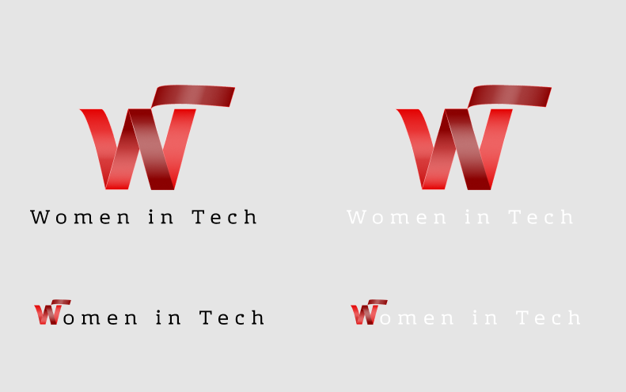

# WIT LOGO - Women In Tech

---

## Description

_The red ribbon symbolizes the bond among women, portraiting the strong yet gentle women in tech. The logo represents unity as how the W, I, and T are interconnected._

## The basics

✅ Only show the WIT logo and monogram over the color `#4A001A` when you need a dark background tone.

❌ Don't alter, rotate, change the colors, dimensions or add your own text/images or modify in anyway the logo or monogram.

❌ Don't integrate the WIT logo or monogram into your logo.

❌ Don't place the logo or monogram over any light version of the red color.

## Logo Colors

The WIT logo has a combination of colors. These colors are key representation of WIT. The main colors are: Red (#E30000) and a darker tone version of red (#8B0101). When placing the WIT logo on a dark background, **always** use the `#4A001A`. For light backgrounds any light color, with the exception of any light version of red, will do fine.

 

### Primary Colors

| RED                  | DARKER RED           |
| -------------------- | -------------------- |
| **HEX** - #E30000l   | **HEX** - #8B0101    |
| **CMYK**- 0 89 89 11 | **CMYK**- 0 54 54 45 |
| **RGB**- 227 0 0     | **RGB**- 139 1 1     |

 

### Secondary Color

| DARK PINK            |
| -------------------- |
| **HEX** - #4a001a    |
| **CMYK**- 0 29 19 71 |
| **RGB**- 74 0 26     |

 

## Logo Pairings

There are two versions of the WIT logo pairing the design and the monogram.

- The primary versions of the WIT logo are with the [black monogram](./WITblkText..svg) for light backgrounds and [white monogram](./WITwhtText.svg) for dark `#4A001A` background.
- When you are looking to use only the monogram, any of the minified versions, [with black text](./WITminBlkText.svg) for light backgrounds or [white text](./WITminWhtText.svg) for dark backgrounds will do.
